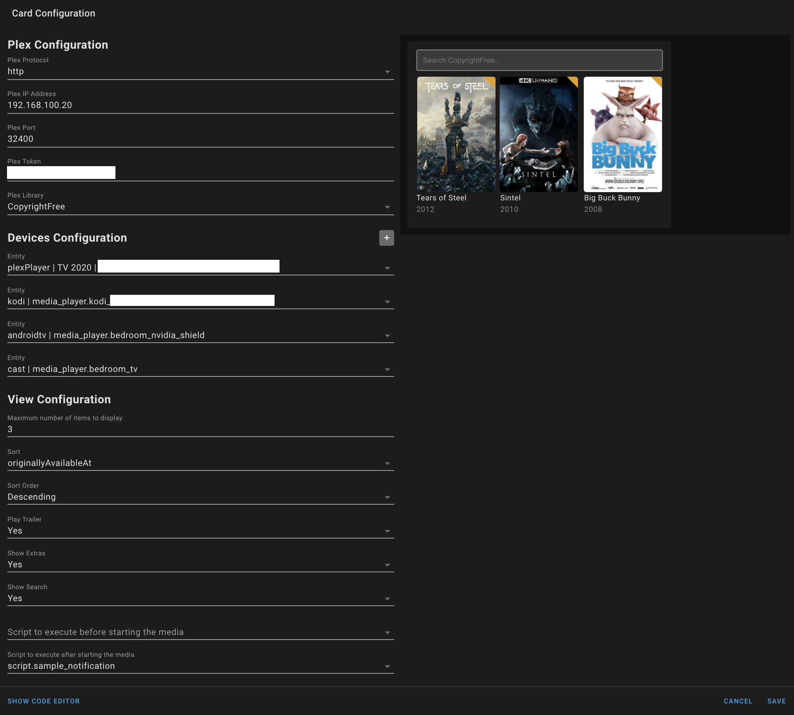
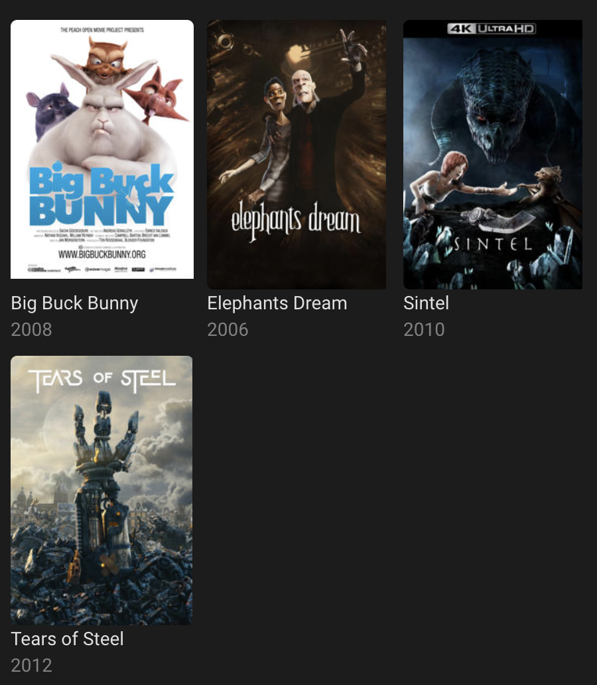
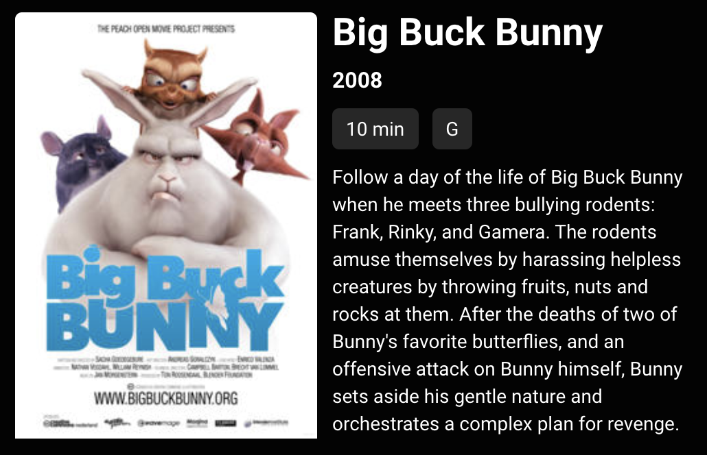

# PlexMeetsHomeAssistant

Custom Home Assistant card which integrates plex into Home Assistant and makes it possible to launch movies or tv shows on TV with a simple click.

Supported are **ALL** Plex clients, some even with enhanced functionality. Kodi with PlexKodiConnect, Android TV and Google Cast is also supported.

Video of the card:

More images [at the end of the readme](https://github.com/JurajNyiri/PlexMeetsHomeAssistant#images).

## Important notice

**If you are using Home Assistant via HTTPS, you need to specify port `https` for Plex and have Plex available on https connection.**

## Installation

- Install **Plex Meets Home Assistant** from HACS.
- Reload browser, clear cache as usual
- Create a new Home Assistant tab, turn on panel mode
- Add a card by clicking Add Card in your lovelace edit mode and finding "Custom: Plex Meets Home Assistant"

## Configuration

You can use UI to configure your card which will automatically load up your libraries and entities. If you wish, you can use card code to configure everything manually. See [Detailed Configuration](DETAILED_CONFIGURATION.md) if you wish to see a lot more information about every property of the card.

Supported target devices are all entities from integrations [Android TV](https://www.home-assistant.io/integrations/androidtv/), [Kodi](https://www.home-assistant.io/integrations/kodi/) and [Google Cast](https://www.home-assistant.io/integrations/cast/).

Supported are also any other devices, available to be cast into from Plex web interface. These are not currently possible to be set up via UI configuration and you will need to edit card code manually for them. Information about this is inside [Detailed Configuration - All other plex clients](DETAILED_CONFIGURATION.md#all-other-plex-clients). You can still use UI to edit anything else.

### Quick guides:

- [Guide How to get Plex Token](https://support.plex.tv/articles/204059436-finding-an-authentication-token-x-plex-token/)
- Play icon will only show up when playing is possible.
- Kodi entities will only work if you are using [PlexKodiConnect](https://github.com/croneter/PlexKodiConnect#download-and-installation) and [Kodi Recently Added Media](https://github.com/jtbgroup/kodi-media-sensors#installation) is installed. See [detailed instructions](https://github.com/JurajNyiri/PlexMeetsHomeAssistant/blob/DETAILED_CONFIGURATION.md#kodi)
- If you have Plex integration set up, Plex player is used for cast entities. Otherwise media is casted as a file.

## Ask for help or help development

Join [Discord](https://discord.gg/jqqz9jQXWx) or [Home Assistant Community](https://community.home-assistant.io/t/custom-component-card-plex-meets-home-assistant/304349).

## Images

# Want to buy me a beer?

# Disclaimer

Author is in no way affiliated with Kodi, Plex, Roku, Android TV, Google or any other companies mentioned above.

Author does not guarantee functionality of this card and is not responsible for any damage.

All product names, trademarks and registered trademarks in this repository, are property of their respective owners.

This card provides user interface for navigating plex library and playing plex content on users devices. It does not host any content on its own and does not provide any plex server.
